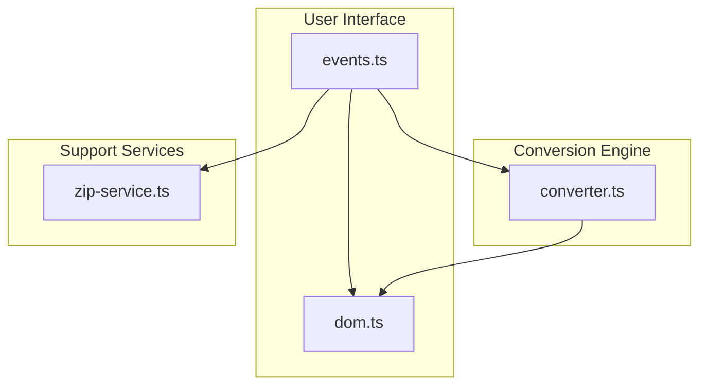

# WEBP Image Converter

High-performance client-side image conversion platform for transforming images into the WebP format directly in the browser. The project was modernized from a legacy script into a scalable modular architecture using TypeScript and Vite.

---

# Overview

The application processes image conversions entirely on the client side, eliminating server-side dependencies while optimizing performance, memory usage and user experience.

The architecture follows Separation of Concerns (SoC) and SOLID principles, ensuring maintainability, scalability and modularity.

---

# System Architecture



---

# Architecture Components

## UI Layer

Responsible for:

- Interface state management
- User interaction handling
- Progress updates
- Responsive rendering workflows

## Conversion Core

Handles:

- Image processing pipelines
- Browser Canvas API operations
- WebP transformation logic
- Compression quality management

## Services Layer

Responsible for:

- ZIP generation workflows
- File aggregation
- Download orchestration
- Resource management utilities

---

# Features

- Batch conversion of up to 50 images simultaneously
- Dynamic compression quality control (1%–100%)
- Optimized browser memory management with Object URL revocation
- Responsive interface for multiple screen resolutions
- Compressed ZIP export workflow
- Fully client-side processing architecture
- Lightweight and optimized runtime execution

---

# Technology Stack

| Layer | Technology |
|---|---|
| Frontend | TypeScript |
| Build Tool | Vite |
| Compression | JSZip |
| Image Processing | Browser Canvas API |

---

# Performance Considerations

The application was designed with a performance-oriented architecture, including:

- Client-side processing to reduce server overhead
- Efficient memory cleanup to prevent memory leaks
- Lightweight conversion workflows
- Optimized batch processing pipeline
- Minimal runtime dependencies

---

# Development Requirements

- Node.js v18+
- npm or Yarn

---

# Installation

## Install dependencies

```bash
npm install
```

---

# Development Environment

```bash
npm run dev
```

---

# Production Build

```bash
npm run build
```

---

# Code Quality

## Run linting

```bash
npm run lint
```

---

# Deployment

The application is optimized for deployment on Vercel.

Vite configuration is automatically detected during deployment.

| Setting | Value |
|---|---|
| Build Command | `npm run build` |
| Output Directory | `dist` |

---

# Engineering Principles

- Separation of Concerns (SoC)
- SOLID Principles
- Modular Architecture
- Performance-Oriented Design
- Client-Side Processing
- Maintainable Code Structure

---

# License

This project is licensed under the MIT License.
